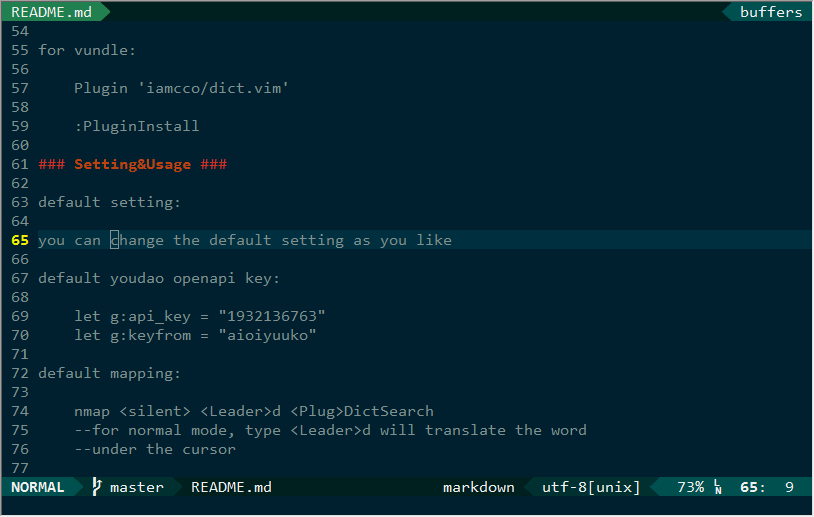

### 说明 ###

这个插件调用的是有道的openapi进行翻译的，需要vim支持python
并且使用的时候需要网络

### 安装 ###

通过 `:echo has('python')` 检查vim是否支持python。
最简单的安装方式就是使用vim插件管理器，比如 [vundle][vundle]

使用vundle安装：

    Plugin 'iamcco/dict.vim'

    :PluginInstall

### 使用和设置 ###

一下是默认的有道openapi的key：

    let g:api_key = "1932136763"
    let g:keyfrom = "aioiyuuko"

你可以设置成你自己申请的

默认快捷键绑定：

    nmap <silent> <Leader>d <Plug>DictSearch
    --普通模式下，<Leader>d 即可翻译光标下的文本

    vmap <silent> <Leader>d <Plug>DictVSearch
    --可视化模式下，<Leader>d 即可翻译选中的文本

在vim配置文件中，可以把 `<Leader>d` 配置为你喜欢的快捷键

默认命令：

    command! -nargs=1 Dict call dict#Search(<q-args>)
    --使用 :Dict hello

=============================================================================

### Introduction ###

An simple translation tool which uses the youdao openapi,
and requires the python feature for your vim/gvim
and network for your client

### Installation ###

this plugin requires python feature, you can check with `:echo has('python')`

An easy way to install the plugin is using an package manager like [vundle][vundle]

for vundle:

    Plugin 'iamcco/dict.vim'

    :PluginInstall

### Setting&Usage ###

default setting:

you can change the default setting as you like

default youdao openapi key:

    let g:api_key = "1932136763"
    let g:keyfrom = "aioiyuuko"

default mapping:

    nmap <silent> <Leader>d <Plug>DictSearch
    --for normal mode, type <Leader>d will translate the word
    --under the cursor

    vmap <silent> <Leader>d <Plug>DictVSearch
    --for V mode, type <Leader>d will translate the word which
    --you have selected

you can change the `<Leader>d` for what you want and save in your vimrc

default command:

    `command! -nargs=1 Dict call dict#Search(<q-args>)`
    --example: ':Dict hello'

[vundle]: https://github.com/gmarik/Vundle.vim
